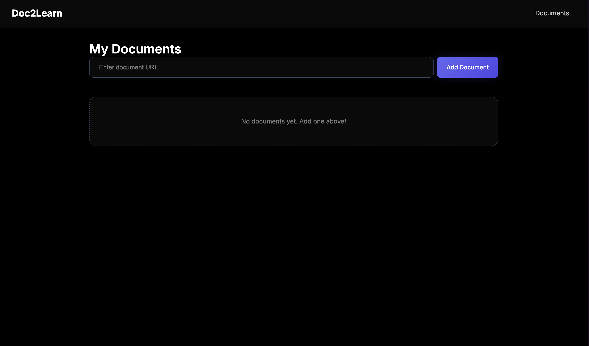
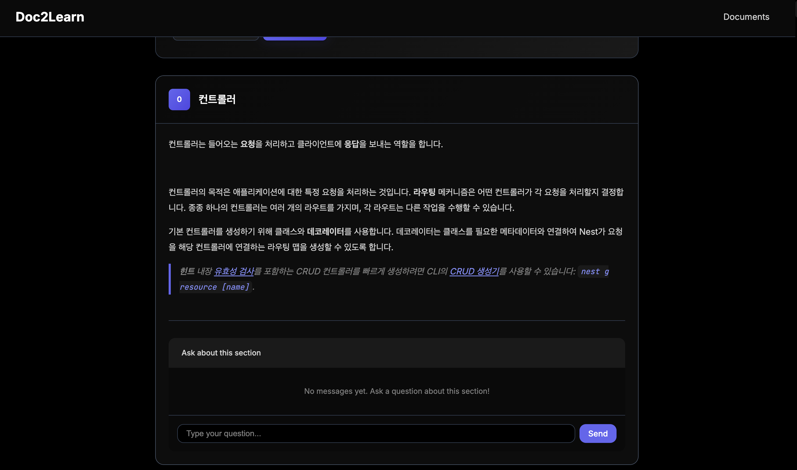
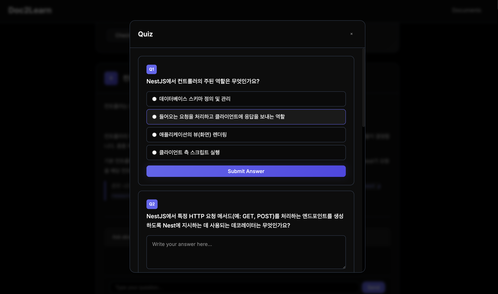

# Doc2Learn

외국어 기술 문서를 번역하고 학습할 수 있는 웹 애플리케이션입니다.

URL을 입력하면 문서를 크롤링하여 마크다운으로 변환하고, LLM을 통해 원하는 언어로 번역합니다. 섹션별로 질문하거나 퀴즈를 풀며 학습할 수 있습니다.

## Features

- **문서 크롤링 & 파싱**: URL에서 문서를 가져와 마크다운으로 변환
- **AI 번역**: Gemini, OpenAI, Claude 중 선택하여 문서 번역
- **섹션별 구성**: 문서를 논리적인 섹션으로 분할하여 표시
- **마크다운 렌더링**: 코드 블록, 링크, 리스트 등 마크다운 서식 지원
- **코드 하이라이팅**: 프로그래밍 언어별 문법 강조
- **섹션별 채팅**: 각 섹션에 대해 AI에게 질문 가능
- **퀴즈 생성**: 문서 내용 기반 퀴즈 자동 생성 및 채점
- **업데이트 감지**: 원본 문서 변경 시 재번역 지원

## Sample Images

### Home
문서 목록 및 새 문서 추가



### Document
번역된 문서 보기 (마크다운 렌더링, 섹션별 채팅)



### Quiz
문서 내용 기반 퀴즈



## Installation

```bash
# 저장소 클론
git clone https://github.com/your-username/doc2-learn.git
cd doc2-learn

# 의존성 설치
npm install

# 개발 서버 실행
npm run start:dev
```

브라우저에서 http://localhost:3000 접속

## Configuration

`data/settings.json` 파일에서 LLM 설정을 구성. llm 한개만 설정해도 사용 가능.

```json
{
  "llm": {
    "providers": {
      "gemini": { "apiKey": "YOUR_GEMINI_API_KEY" },
      "openai": { "apiKey": "YOUR_OPENAI_API_KEY" },
      "claude": { "apiKey": "YOUR_CLAUDE_API_KEY" }
    },
    "order": ["gemini", "openai", "claude"]
  },
  "language": "ko"
}
```

### 설정 항목

| 항목 | 설명 |
|------|------|
| `llm.providers` | 각 LLM 제공자의 API 키 설정 |
| `llm.order` | LLM 사용 우선순위 (첫 번째부터 시도, 실패 시 다음으로 fallback) |
| `language` | 번역 대상 언어 (ko, en, ja 등) |

### 지원 LLM

| Provider | Model |
|----------|-------|
| Gemini | gemini-2.5-flash |
| OpenAI | gpt-4.1-mini |
| Claude | claude-sonnet-4-20250514 |

## Usage

1. **문서 추가**: 홈 화면에서 URL 입력 후 "Add Document" 클릭
2. **문서 보기**: 문서 목록에서 제목 클릭
3. **섹션 탐색**: 각 섹션별로 번역된 내용 확인
4. **질문하기**: 섹션 하단의 채팅창에서 해당 섹션에 대해 질문
5. **퀴즈 풀기**: "Take Quiz" 버튼으로 문서 내용 기반 퀴즈 풀기
6. **업데이트 확인**: "Check Updates"로 원본 문서 변경 여부 확인

## Tech Stack

- **Backend**: NestJS, TypeScript
- **Frontend**: Handlebars, Vanilla JS
- **Styling**: Custom CSS (Dark Theme)
- **Markdown**: marked.js, highlight.js
- **LLM**: Gemini AI, OpenAI, Anthropic Claude
- **Crawling**: Puppeteer, Cheerio, Turndown

## Project Structure

```
doc2-learn/
├── src/
│   ├── chat/           # 섹션별 채팅 기능
│   ├── config/         # 설정 관리
│   ├── document/       # 문서 파싱 & 번역
│   ├── llm/            # LLM 프로바이더 (Gemini, OpenAI, Claude)
│   ├── quiz/           # 퀴즈 생성 & 채점
│   ├── storage/        # 파일 기반 데이터 저장
│   ├── view/           # 뷰 컨트롤러
│   └── views/          # Handlebars 템플릿
├── public/
│   ├── css/            # 스타일시트
│   └── js/             # 클라이언트 스크립트
├── data/
│   ├── settings.json   # 앱 설정
│   └── documents/      # 저장된 문서 데이터
└── docs/
    └── sample-images/  # 스크린샷
```

## License

MIT